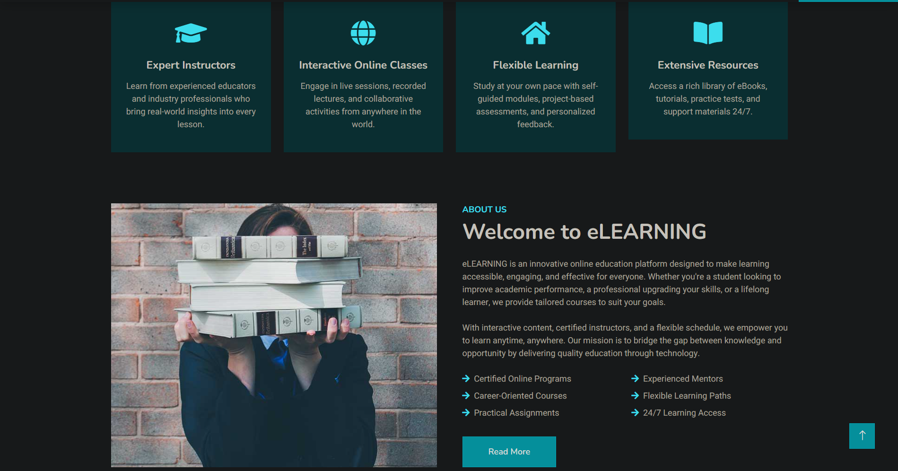
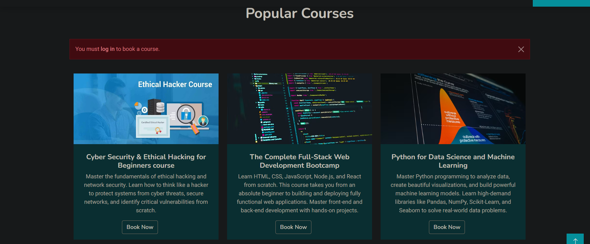

# EduSphere — E-Learning Platform

EduSphere is a PHP and MySQL based e-learning platform developed to provide a simple and user-friendly environment for online learning. The project includes user authentication, course management, course browsing, search functionality, and database-driven content.

## 🚀 Features

### 🏠 Home Page
- Responsive homepage with image carousel
- Services section
- About section
- Course section for browsing available courses

### 📚 Course Management
- Users can browse available courses
- Course details can be viewed before enrollment
- Course selection is connected with user authentication
- Users must log in before accessing course enrollment/booking functionality

### 🔐 User Authentication
- User registration
- User login and logout
- Authentication-based course access
- Unauthenticated users are redirected to the login page when attempting to access protected course functionality

### 👨‍💼 Admin Panel
- Admin login
- Course management
- User management
- Booking/enrollment management
- Query/contact management

### 🔎 Other Features
- Course search functionality
- Contact and feedback functionality
- Database-driven content
- Responsive Bootstrap-based interface

## 📸 Screenshots

### 🏠 Home Page — Hero & Navigation


### 📚 Services & About


### 🎓 Courses


### 🔐 Course Authentication
Users can browse courses without logging in. When an unauthenticated user tries to book a course, the system requires login before proceeding.



## 🛠️ Technologies Used

* **Frontend:** HTML5, CSS3, JavaScript, Bootstrap
* **Backend:** Core PHP
* **Database:** MySQL
* **Server:** Apache
* **Development Environment:** XAMPP
* **Code Editor:** Visual Studio Code
* **Version Control:** Git & GitHub

## 📂 Project Structure

```text
EduSphere/
│
├── Admin/              # Admin panel
├── Database/           # Database SQL file
├── css/                # Stylesheets
├── img/                # Images and media
├── js/                 # JavaScript files
├── lib/                # Libraries and plugins
├── scss/               # SCSS source files
├── upload/             # Uploaded assets
│
├── index.php           # Homepage
├── about.php           # About page
├── courses.php         # Courses page
├── search.php          # Course search
├── register.php        # User registration
├── user_login.php      # User login
├── admin_login.php     # Admin login
├── booking.php         # Course booking/enrollment
├── contact.php         # Contact page
│
├── config.example.php  # Example database configuration
├── .gitignore          # Git ignored files
└── README.md           # Project documentation
```

## ⚙️ Installation & Setup

### 1. Clone the repository

```bash
git clone https://github.com/Ranjan-kumar-yadav/EduSphere-E-Learning-Platform.git
```

### 2. Move the project to XAMPP

Place the project folder inside:

```text
C:\xampp\htdocs\
```

The final path should be:

```text
C:\xampp\htdocs\EduSphere
```

### 3. Start XAMPP

Open XAMPP Control Panel and start:

* Apache
* MySQL

### 4. Create the database

Open phpMyAdmin:

```text
http://localhost/phpmyadmin
```

Create a database named:

```text
edusphere
```

Then import the SQL file:

```text
Database/edusphere.sql
```

### 5. Configure the database connection

Create your local `config.php` file based on:

```text
config.example.php
```

Update the database credentials according to your local MySQL configuration.

> **Note:** `config.php` is intentionally excluded from GitHub because it contains local database credentials.

### 6. Run the project

Open your browser and visit:

```text
http://localhost/EduSphere/
```

## 🔐 Security

Sensitive local configuration files such as `config.php` and `db_conn.php` are excluded from version control using `.gitignore`.

Do not upload database passwords, API keys, or other private credentials to GitHub.

## 🎨 Frontend Template Attribution

The frontend UI of this project was adapted and customized from the free **eLEARNING HTML Template by HTML Codex**.

The project-specific backend functionality, PHP/MySQL integration, database setup, and custom features were developed as part of this project.

Template source:

https://htmlcodex.com/elearning-html-template/

## 📚 Learning Outcomes

Through this project, I gained practical experience in:

* Core PHP development
* MySQL database integration
* CRUD operations
* User authentication
* HTML, CSS and JavaScript
* Bootstrap-based responsive design
* PHP form handling
* Git and GitHub
* XAMPP-based local development

## 👨‍💻 Author

**Ranjan Kumar**

Computer Science & Engineering Student

### ⭐ Project

If you find this project useful, feel free to explore the repository and give it a star.
